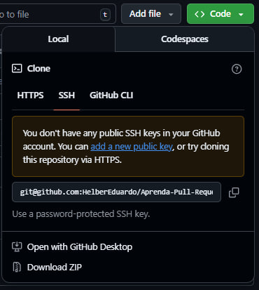
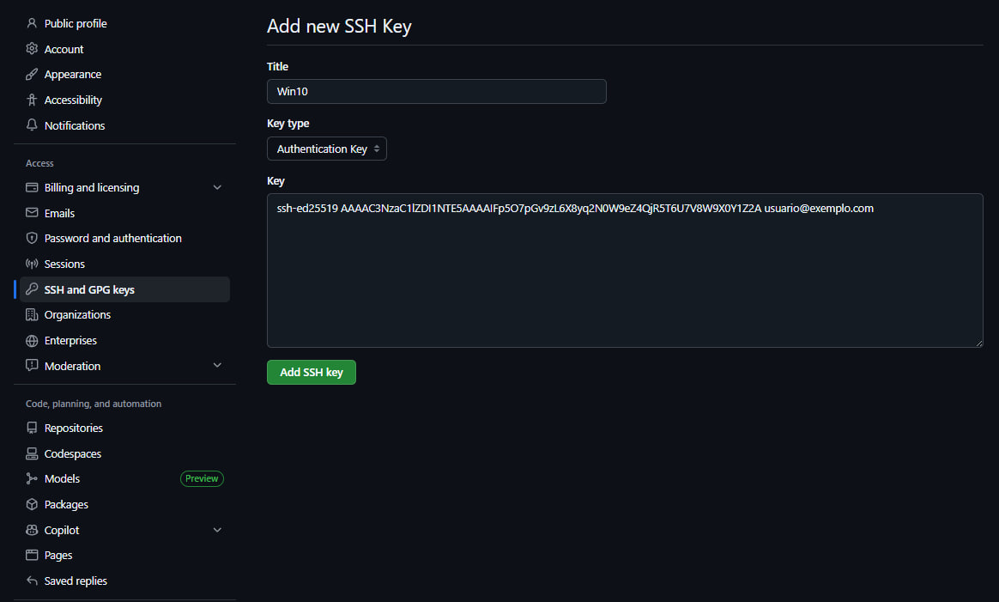
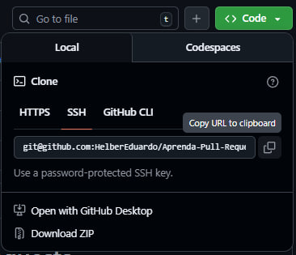
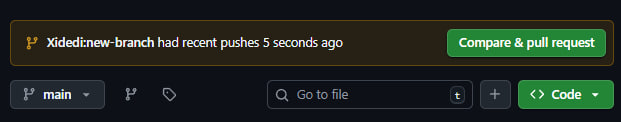
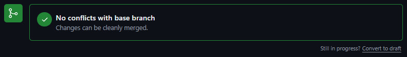

# Aprenda Pull Requests

Este repositório contém o desenvolvimento e a documentação da atividade extensionista realizada para o curso de Análise e Desenvolvimento de Softwares na Gran Faculdade

## Objetivo
O projeto visa desenvolver soluções computacionais práticas que automatizem processos e organizem informações, aplicando o conhecimento técnico do curso para atender demandas reais da comunidade e promover a transformação digital.

---

## Guia de Configuração

Se você acabou de clonar este repositório em uma máquina sem nada instalado, siga a sequência abaixo para garantir que tudo funcione corretamente.

### 1. Pré-requisitos
Antes de começar, você precisará ter instalado:
* Git

### 2. Passo a Passo para Execução


1.  **Configurando identidade:**

    > Você diz ao Git quem você é (`config`). Sem isso, seus commits ficam "anônimos".

    > Substitua o conteúdo entre aspas duplas por suas informações do github e pressione enter
    ```
    git config --global user.name "Seu Nome"
    ```
    ```
    git config --global user.email "seu-email@exemplo.com"
    ```

2.  **Autenticação (SSH):**

    > Você cria uma chave de segurança para que o GitHub saiba que é você, sem precisar de senha em cada comando.
    ```
    ssh-keygen -t ed25519 -C "seu-email@exemplo.com"
    ```
    > Após o código acima, aparecerá algumas perguntas e você apertará Enter para todas. Resumidamente as perguntas são:
    1. > Onde salvar a chave SSH? Caso já existe, a pergunta será se é para substituir;
    2. > Criar uma senha. Mesmo que alguém consiga acesso a sua chave SSH, precisará dessa senha para ter acesso;
    3. > Confirmar senha.

    Agora vamos iniciar o SSH Agent
    ```
    eval "$(ssh-agent -s)"
    ```
    > Vamos entregar nossa chave ao Agent
    ```
    ssh-add ~/.ssh/id_ed25519
    ```
    > Agora que o nosso Agent SSH tem nossa chave, vamos registra-lá na conta do github, vamos precisar copiar ela, então encontre ela usando o seguinte comando e depois copie:
    ```
    cat ~/.ssh/id_ed25519.pub
    ```
    > Indo ao topo desse página ou acessando [Link do repositório](https://github.com/HelberEduardo/Aprenda-Pull-Requests#) você clica no botão verde escrito "code"

    

    > Clicando em SSH aparecerá um aviso, clique em "add a new public key"

    

    > Adicione um título para sua chave e no campo "key" adicine a chave SSH que você copiou e clique em "Add ssh key".

    

3.  **Fork:**

    >No topo desse página ou acessando [Link do repositório](https://github.com/HelberEduardo/Aprenda-Pull-Requests#) clique no botão "Fork"

    

    >Você cria uma cópia do projeto original na sua conta do GitHub. Agora você é o dono dessa cópia.

4.  **Clone do repositório:**
    >Agora que a cópia do projeto foi feita, vamos fazer um clone local para realizar nossas contribuições. Escolha uma pasta e a partir dela abra um terminal.

    > Copie o link SSH do seu repositório

        

    > Feito isso, vamos voltar ao terminal e clonar o repositório com o seguinte comando:

    ```
    git clone git@github.com:SEU_USUARIO/NOME_REPO.git 
    ```
    > Use o link SSH após o `git clone`" e pressione enter

5.  **Contribuindo:**

    > Use `cd NOME_REPOSITORIO` ou abra a pasta do repositório e inicie um termial git a partir dela.

    > E depois:

    ```
    git checkout -b minha-nova-branch
    ```

    > Agora adicione na pasta um arquivo SEU_NOME.txt

    > Os três comandos a seguir são respectivamente:
    1. > Prepara os arquivos
    ```
    git add .
    ```
    2. > Grava as alterações
    ```
    git commit -m "Descrição do que eu fiz" 
    ```
    3. > Envia para o seu GitHub

    ```
    git push -u origin minha-nova-branch  
    ```

6.  **Compare & pull request**
    > Volte ao seu repositório no GitHub

    > Note que há um botão novo:

    

    > Clicando em "Compare & Pull Request, aparecerá um resumo do que foi alterado e comentado.
    
    > Clique em "Creaste pull request"
    

    > Após aparecer a mensagem abaixo, está feito! O dono do repositório original acaba de receber suas contribuições.

    
    ---
